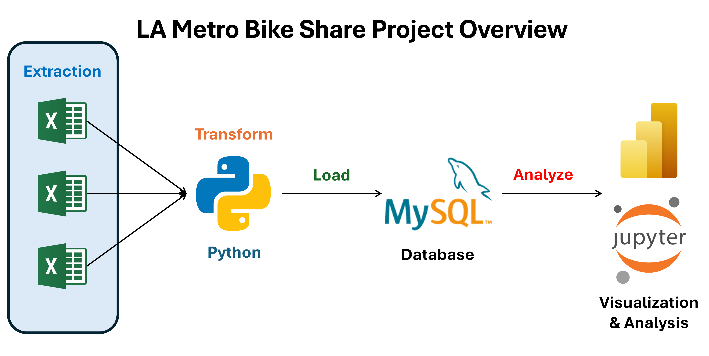
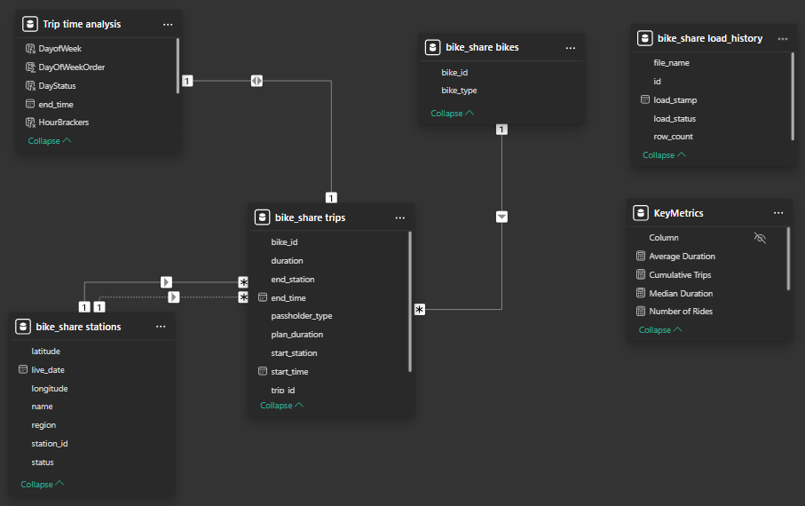
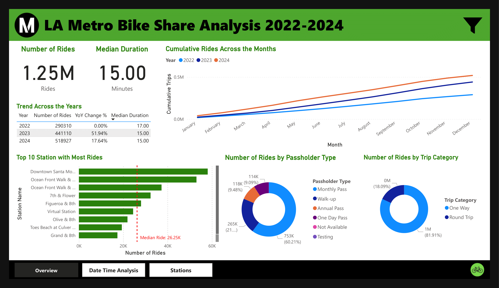
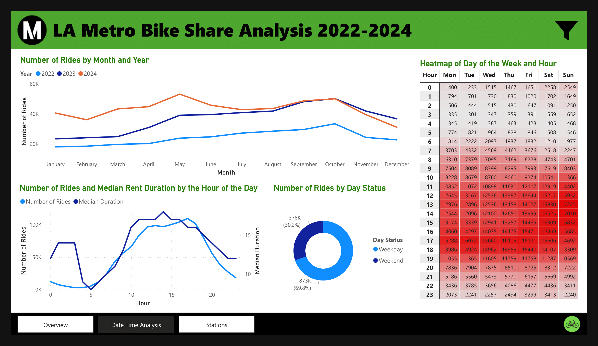
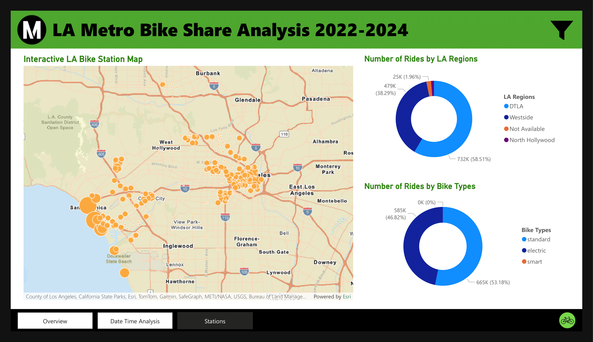
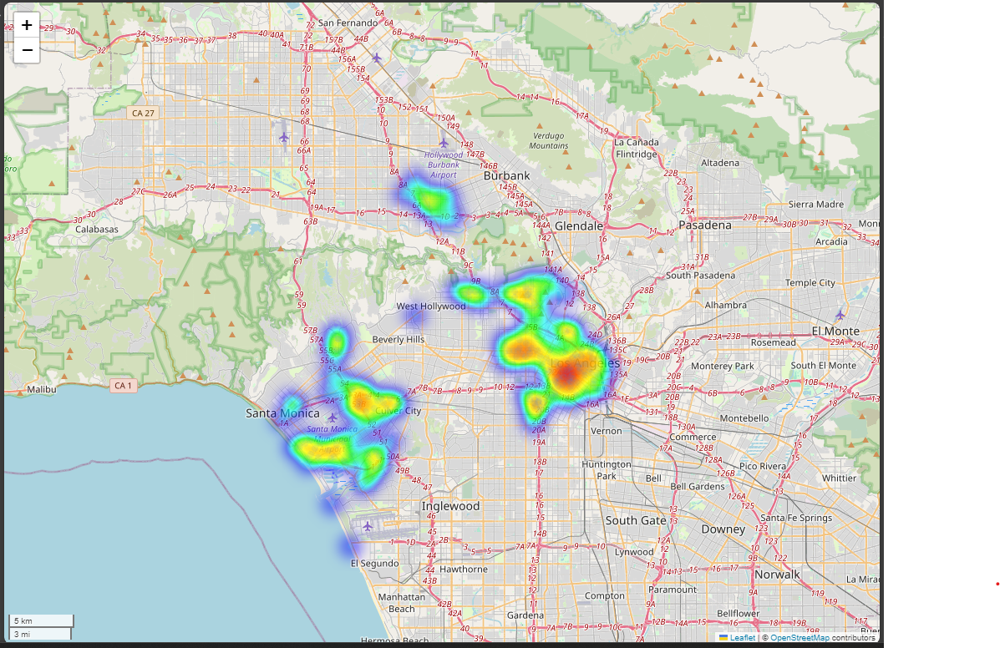
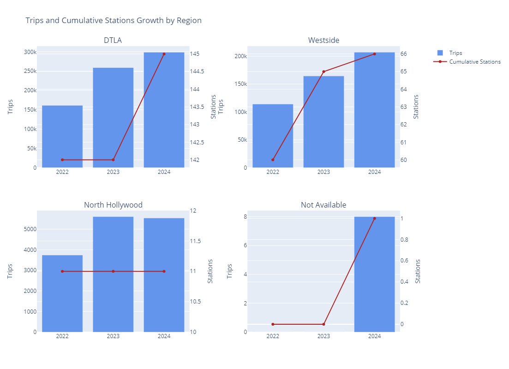
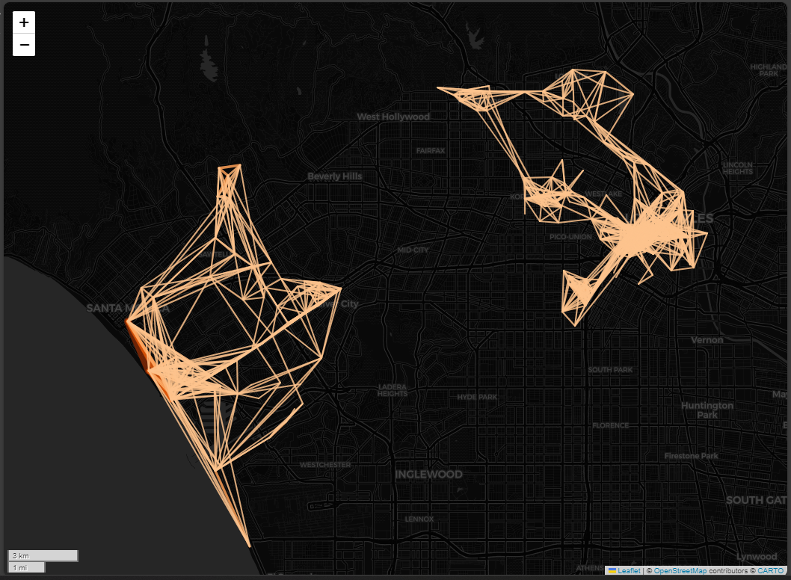
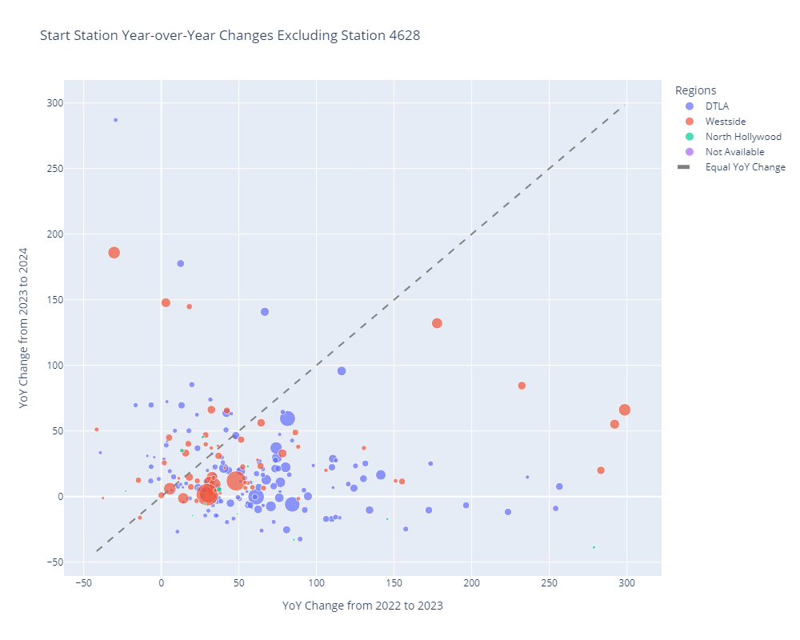

# City of Los Angeles Metro Bike Share Analysis

## Background
Metro Bike Share is a 24/7 bike rental service operated by Bicycle Transit Systems. It was formed from a partnership between the City of Los Angeles and Metro and lauched in the third quarter of 2016. Currently, the bike rental stations cover Downtown LA (DTLA), Central LA, Westside, Hollywood, and North Hollywood. 

## Objective
This project analyzes the [Bike Share data](https://bikeshare.metro.net/about/data/) from 2022 to 2024 to provide insights into the users' behavior and top stations. It aims to provide operators with valuable insights to optimize resource allocation, such as bike maintenance, and help riders better understand the general usage trend of this public service. 

## Project Overview
The project is separated into two main sections: data extraction, transformation, and loading with Python and MySQL and data visualization and analysis with Power BI. Quartery Excel spreadsheets of Bike Share Trips is extracted and transformed by Python and stored in [MySQL database](./db/README.md) to ensure consistency across time periods and ease of analysis with Power BI. The demonstration for this dashboard is available as a [pdf file](./LA_MetroBikeShare_Dashboard_Demonstation.pdf). Additionally, spatial analysis was conducted on [Jupyter Notebook](02_Spatial_Visualization_and_Analysis.ipynb).

**Extract, Transform, Load, and Analysis**

**Power BI Relationships**  

## Analysis Insights
### Bike Share Overview
* A total of 1.25 million bookings was done from 2022 to 2024 with the median ride duration of 18 minutes.
* The number of rides grew 51.94% from 2022 to 2023 and at 17.64% from 2023 to 2024.
* The top 3 stations with most trips are Downtown Santa Monica E Line Station, Ocean Front Walk & Navy, and Ocean Front Walk & North Venice. These regions are from Westside of LA.
* Majority of the bike users have montly pass (60.21%) and the most common trip is a one way at 81.91%.

### Date and Time Analysis
* Compare between years, the number of users increase during May and in October.
* The number of users increase from the lowest at 5:00 to the peak usage at 17:00 before decreasing. Majority of the trips were made in weekdays at 69.8%.
* The heatmap confirms the reported rush hour period from 7:00 and 10:00 in the morning and from 16:00 to 19:00 in the evening (Discover Los Angeles, 2024).

### Bike Stations
* Majority of the Bike Stations are in Downtown Los Angeles at 58.51% followed by Westside at 38.29%.
* Standard bike is the predominant bike type at 53.1% followed by Electic bike at 46.82%. Whereas there is only 22 reports of trips done by smart bikes.

### Spatial Analysis and Visualization
* Overall, majority of the trips across these three years was done in the DTLA followed by the Westside region as demonstrated by the heatmap.

* An analysis of trips and cumulative station growth by region over the years reveals that between 2022 and 2023, in both the DTLA and North Hollywood regions, the number of active stations remained constant while the number of users increased. This suggests growing public adoption of the transportation method during that period.
* Between 2023 and 2024, DTLA added only three new stations, yet usage continued to rise. In contrast, North Hollywood saw relatively stable usage with no change in the number of stations.
* For Westside, the number of usage continuously increase across the recored period.

* The top three routes with the highest number of trips were made between Downtown Santa Monica E Line Station and Ocean Front Walk & Navy at an average of 27.58 minutes per trip. This is followed by Ocean Front Walk & North Venice and Ocean Front Walk & Navy at an average of 23.10 minutes per trip and Downtown Santa Monica E Line Station and Ocean Front Walk & Navy at an average of 34.84 minutes per trip.

* Scatter plot of Year-over-year changes revealed majority of the stations have declined YoY growth in 2023-2024 compared to 2022-2023, with the majority of the high volume stations have growth slowed down. This suggested that these stations might reach its regular customer base capacity. 

## Key Takaways
- **Customer Behaviour**: As majority of the trips occur between 7:00 and 21:00, the operator could utilized the lower usage period for routine bike maintainance.
- **Potential Services**: Given the median ride duration is 15 minutes, while the pricing is offered at a fixed 30-minute ride. There might be an opportunity to introduce packages for riders to align with the actual usage pattern.
- **YoY Station Usage Growth**:  With our YoY data indicates that the majority of the stations have declined growth compared to previous year, a follow-up study should be conducted to evaluate wheter theses stations have reach its regular customer base capacity.
- **Potential Service Area Exapansion**: With the high volume of trips in the Westside suggested a strong demand. Conducting a feasibility study to expand additional bike stations within the area could improve a better support for the demands.

## Limitations and Futurework
* As this dataset is anonymized, certain values such as passholder type would contain duplicate entries and are not representative of the actual number of passholders. Thus, any decisions made using this data should take this into consideration.
* This project operated under the assumption that the most recently uploaded station dataset is the most accurate. Thus, certain trips were excluded due to mismatched in station id. Future research should explore this inconsistency within the data.
* Although we tackled the geographical visualization limitation of the Power BI by utilizing Folium. The current scope of exploration is limited to the present data. Future work should icorporate demographic data to provide more comprehensive analysis on the possiblity of expanding this service.

## References
* Discover Los Angeles (2024). The Guide to Driving in Los Angeles | Discover Los Angeles. [online] www.discoverlosangeles.com. Available at: https://www.discoverlosangeles.com/travel/the-guide-to-driving-in-los-angeles [Accessed 22 Mar. 2025].
* Metro Bike Share (2016). Data. [online] Metro Bike Share. Available at: https://bikeshare.metro.net/about/data/ [Accessed 22 Mar. 2025].
 