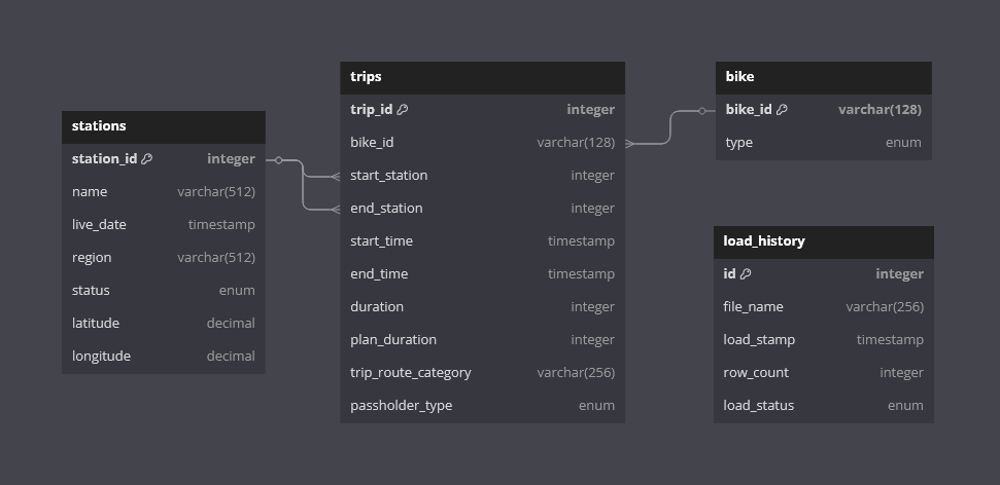

## Database Design Doucment

## Database Scope and Design Rationale
This database is created based on the publicly disclosed information.
As certain information, such as passholder information, is anonymized, we will combine it with other information as a table. 
If certain data could be group and remove redundacy in the database, it would be separated into a new table.

## Entities
### Stations

The stations table includes the following:

* `station_id` unique ID  for each station as `INT`, which is the `PRIMARY KEY`. It is based on the stations file.
* `name` specifies the public name of the station as `VARCHAR`. To support future naming, we will set it to 512 characters.
* `live_date` specifies the first available date of the station as `DATE`.
* `region` specifies the region that the station is located as `VARCHAR`. To support future naming, we will set it to 512 characters.
* `status` Lastest update status of the station as either 'Active' or 'Inactive'.
* `latitude` specifies the latitude of the station as `DECIMAL`
* `longitude` specifies the longtitude of the station as `DECIMAL`

### Bike

The bike table includes the following:

* `bike_id` unique ID for the bikes as an `VARCHAR` with 128 characters as the bike id consists of both numerical and alphabetical characters. This is the `PRIMARY KEY` for this table.
* `type` specifies the type of bikes as 'standard', 'electric' or 'smart'.

### Trips

The trips table contains both the trip and passholder information, since the passholder is anonymized, as follows:

* `trip_id` unique ID for the trips as an `INT`. This is the `PRIMARY KEY` for this table.
* `bike_id` specifies the bike ID as `VARCHAR` with 128 characters. This is a `FOREIGN KEY` referencing `id` column in the `bike` table.
* `start_station` specifies the start station ID as `INT`. This is a `FOREIGN KEY` referencing `station_id` column in the `stations` table.
* `end_station` specifies the end station ID as `INT`. This is a `FOREIGN KEY` referencing `station_id` column in the `stations` table.
* `start_time` specifies the start date time of the trip as `DATETIME`.
* `end_time` specifies the end date time of the trip as `DATETIME`
* `duration` provides the trip duration in minutes as `INT`.
* `plan_duration` provides the number of days that the passholder us using entitle them to ride. Zero value indicates that the passholder is using a single ride plan.
* `trip_route_category` provides the trip route either 'Round Trip' or 'One Way' as `ENUM`. 
* `passholder_type` is the name of passholder's plan as `ENUM`, having value of 'Walk-up', 'One Day Pass', 'Monthly Pass', 'Annual Pass', 'Testing', or 'Not Available'.

### Load History

This table is implemented in the database to support scaling of this idea. As load history tracks which file has already loaded into the MySQL database.

* `id` unique ID as `INT` for this table it `AUTO INCREMENT` when new entry is added.
* `file_name` specifies the name of the files that has already been loaded in the database as `VARCHAR` at 256 characters.
* `load_stamp` specifies the timestamp in which the data was loaded as `DATETIME`.
* `row_count` specifies the number of the rows of the loaded file as `INT`.
* `load_status` is the status of the loaded file being `ENUM` as either `Success` or `Failure`.

## Relationships
The relationship of the implemented database follows the ER diagram below:

## Limitations
* This database is based on the available station information file. There are some inconsistency between the stations data and the trips data. In this project we utilized the station as the basis for this analysis.